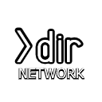

<!-- PROJECT LOGO -->
 

  

  <h3 align="center">"Readme" for our network.</h3>

  

    Here you will find everything you need to know about us, our plans for the future and the way we want to go.
     

<!-- TABLE OF CONTENTS -->
### Table of Contents

* [Why this network?](#Why-this-network)
* [How does it works?](#how-does-it-works)
  * [Webserver](#Webserver)
  * [Uploader](#Uploader)
* [File Sharing](#File-Sharing)
* [Contact](#Contact)

<!-- ABOUT THE PROJECT -->
# Why this network?

This network is there to ensure that there are fewer phishing attacks on smaller budding users who want to check a few accounts. There are just too many free cracks at the moment, which are only designed to harm the user or to enrich themselves.

When the scene was even smaller, everything was a little more open and people were happy to exchange ideas. Today, each source code is copied and output as its own. Something should change.

<!-- GETTING STARTED -->
# How does it works?

Basically it is a very simple solution. There are always different people involved in such software.
* Someone who has the idea and (mostly) develops the software.
* Someone who uses this software actively (with updates).
* Someone who advertises this software (YouTube videos or similar).

We focus here on each group so that it can become a gathering point. Basically we want to start inviting the three to our network.

We want to divide the three groups into roles, that would be:
* Rank 3 (lowest) - developer
* Rank 2 (middle) user
* Rank 1 (highest) - video producer

We made this arrangement because our focus should first be on expanding the network and gathering contacts. After we have reached a certain memorandum, the focus should then be implemented. But since we are a network, we will then start a vote.

### Webserver

What does a web server have to do with the network?
Very easily. Because we need a collection point and there will be data that will be uploaded by uploaders and downloaded by users for advertising and use.

Here is in planning that we want to include the following things:
* Your own shortened links (with and without advertising space)
* Your own "pastebin"
* Forum
* Discord (for quick support and exchange)
* Own generators for the provision of unused accounts and combos.

### Uploader
Our idea is that we assign different roles.
For example, we have some where you can be sure that they won't upload anything that harms others. These are verified by labeling in their profile.
Then there should be some that do the associated video tutorials, so that we always have a "How To" and, if necessary, questions that would come with a written "How To" directly expire.

The roles will only come into force once our network has reached a certain basic size.

# File Sharing

File sharing should be simple.
There should be no annoying surveys and no shortened links with advertising, which are placed three times in a row.

A contribution should be created with a shortened link, a preview and a virus total link.

This would then be a task for the fictional role "Uploader."

<!-- CONTACT -->
## Contact
Discord - https://discord.gg/653rwG8
Twitter - http://twitter.com/crackedworldcc
Youtube - https://www.youtube.com/channel/UCemjIMdq_U5t2GycZwdGq-w?
Homepage - http://www.cracked-world.cc
Homepage 2 - http://dir-network.com/

<!-- MARKDOWN LINKS & IMAGES -->
<!-- https://www.markdownguide.org/basic-syntax/#reference-style-links -->
[contributors-shield]: https://img.shields.io/github/contributors/othneildrew/Best-README-Template.svg?style=flat-square
[contributors-url]: https://github.com/othneildrew/Best-README-Template/graphs/contributors
[forks-shield]: https://img.shields.io/github/forks/othneildrew/Best-README-Template.svg?style=flat-square
[forks-url]: https://github.com/othneildrew/Best-README-Template/network/members
[stars-shield]: https://img.shields.io/github/stars/othneildrew/Best-README-Template.svg?style=flat-square
[stars-url]: https://github.com/othneildrew/Best-README-Template/stargazers
[issues-shield]: https://img.shields.io/github/issues/othneildrew/Best-README-Template.svg?style=flat-square
[issues-url]: https://github.com/othneildrew/Best-README-Template/issues
[license-shield]: https://img.shields.io/github/license/othneildrew/Best-README-Template.svg?style=flat-square
[license-url]: https://github.com/othneildrew/Best-README-Template/blob/master/LICENSE.txt
[linkedin-shield]: https://img.shields.io/badge/-LinkedIn-black.svg?style=flat-square&logo=linkedin&colorB=555
[linkedin-url]: https://linkedin.com/in/othneildrew
[product-screenshot]: images/screenshot.png
